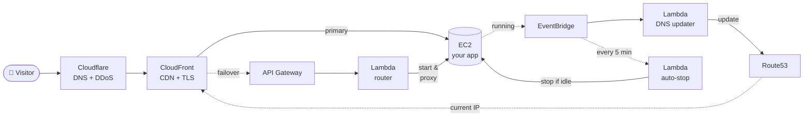

# scale-to-zero-aws-ec2

> Run a real web app on AWS for **~$1/month**. The EC2 sleeps when no one
> is around and wakes up automatically when a visitor arrives — without
> losing the URL or any persistent data.

This is **not** Lambda or App Runner. It's a regular EC2 with Docker (or
whatever you want), fronted by CloudFront, that turns itself off when
idle. The control plane (~3 small Lambda functions and a couple of
EventBridge rules) handles wake-up, DNS bookkeeping, and idle detection.

[](https://www.terraform.io/)
[](https://aws.amazon.com/)
[](LICENSE)

## Why?

A small web app that takes ~5 visitors per day shouldn't cost more than a
coffee per year. But you also don't want to:

- Rewrite your PHP / Rails / Django app to run on Lambda.
- Pay for an Application Load Balancer ($16/mo) just to forward requests.
- Keep an EC2 running 24/7 ($6-15/mo) when it's idle 95% of the time.
- Lose your URL bookmarks every time the instance restarts.

This stack runs your **unmodified** containerized app on EC2, but only
when someone actually wants to use it.

## Architecture



Full diagrams (cold-start sequence, auto-stop loop) live in
[`docs/architecture.md`](docs/architecture.md).

## Costs

For a site with a handful of daily visitors:

| Component               | Monthly |
| ----------------------- | ------: |
| EBS root + data (12 GB) | $0.96 |
| Route53 zone            | $0.50 |
| EC2 compute (≈15 h/mo)  | $0.13 |
| CloudFront / API GW     | $0 (free tier) |
| Lambda × 3              | $0 (free tier) |
| Elastic IP              | $0 (not needed!) |
| **Total**               | **~$1.6/mo** |

> 💡 A typical always-on setup (EC2 24/7 + Elastic IP + ALB) costs
> **$25-40/month** for the same workload. This stack is **95% cheaper**.

A 24-hour bot flood (~1.4 M requests) adds about **$1-3** thanks to
CloudFront caching and the loading page absorbing repeats. Numbers and
math in [`docs/cost-analysis.md`](docs/cost-analysis.md).

## What you get

- **No URL changes**: visitors always see the same `https://app.example.com`
- **No Elastic IP needed**: saves ~$3.65/month — Route53 + Lambda handle the dynamic IP automatically
- **Persistent data**: EBS data volume survives stop/start (no data loss between sessions)
- **HTTPS by default**: CloudFront + ACM, free
- **Sane bot defense**: Cloudflare in front, CloudFront cache, AWS Budget alarm
- **One-command deploy**: `terraform apply`
- **No SSH keys to manage**: SSM Session Manager (with optional SSH-over-SSM)

## What you don't get

- Sub-second cold starts (the EC2 takes ~30-60 s to boot)
- Latency below the CloudFront round-trip on cache misses
- Stateful per-instance things (the IP changes on every start)

If those matter, you probably want App Runner or Fargate, not this.

## Quick start

```bash
git clone https://github.com/axilleasdev/scale-to-zero-aws-ec2.git
cd scale-to-zero-aws-ec2/terraform

# Required inputs: domain, AWS account, the cert validation CNAME you'll
# add in your DNS provider, etc.
cp terraform.tfvars.example terraform.tfvars
# … edit terraform.tfvars …

terraform init
terraform apply
```

Step-by-step walkthrough in [`docs/setup.md`](docs/setup.md).

## Repository layout

```
scale-to-zero-aws-ec2/
├── terraform/        # All AWS infrastructure (variabilized)
├── lambda/           # Python source for the 3 control-plane Lambdas
├── docs/             # Architecture, cost analysis, setup guide
├── examples/         # Sample apps you can deploy as the workload
│   └── hello-world/  # Minimal Docker Compose stack
└── LICENSE
```

## Status

Battle-tested on a real-world deployment for a side project (a PHP/MySQL
web app). The pattern itself is straightforward but assembling all
the AWS bits without breaking anything took a couple of weekends — this
repo is the tidy version of that.

## Contributing

Issues and PRs are welcome. Especially:

- Other workload examples (Node, Python, Go web apps)
- Tightening the security model (`X-Origin-Auth` header verification,
  CloudFront-IP-only Security Group rotator)
- A `terraform module` packaging that lets you bring your own VPC

## License

MIT — see [`LICENSE`](LICENSE).
