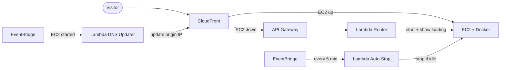

# scale-to-zero-aws-ec2

> Run any web app on AWS for **~$1/month**. Your EC2 sleeps when nobody visits and wakes up automatically when someone does.

No URL changes. No data loss. No rewriting your app.

[](https://www.terraform.io/)
[](https://aws.amazon.com/)
[](LICENSE)
[](https://github.com/axilleasdev/scale-to-zero-aws-ec2/actions)

---

## How it works

```
Visitor → CloudFront → EC2 (if awake) ✓ fast response
                     → Lambda (if asleep) → starts EC2 → "loading..." page → auto-refreshes
```

- **No visitors for 5 min?** → EC2 stops automatically (saves money)
- **New visitor arrives?** → EC2 starts, app loads in 15-40 seconds
- **EC2 gets a new IP?** → Lambda updates CloudFront origin automatically

## Cost comparison

| Setup | Monthly cost |
|-------|-------------|
| **This module** (EC2 runs ~15h/month) | **~$1.60** |
| EC2 always-on + ALB | ~$30 |
| App Runner (min instances) | ~$7 |

## Quick start

### Option 1: Use as Terraform module

```hcl
module "scale_to_zero" {
  source = "github.com/axilleasdev/scale-to-zero-aws-ec2"

  providers = {
    aws           = aws
    aws.us_east_1 = aws.us_east_1
  }

  name_prefix = "myapp"
  app_port    = 8080
}
```

### Option 2: Clone and deploy

```bash
git clone https://github.com/axilleasdev/scale-to-zero-aws-ec2.git
cd scale-to-zero-aws-ec2/examples/complete
terraform init && terraform apply
```

That's it. You'll get a CloudFront URL that serves your app.

## What you need

- AWS account
- Terraform >= 1.5
- A containerized app (Docker Compose) listening on a port

## Variables

| Name | Default | Description |
|------|---------|-------------|
| `name_prefix` | `"ondemand"` | Prefix for all resource names |
| `app_port` | `8080` | Port your app listens on |
| `instance_type` | `"t4g.small"` | EC2 instance type |
| `public_domain` | `""` | Custom domain (optional) |
| `auto_stop_idle_window_min` | `15` | Minutes of idle before stopping |
| `api_throttle_rate` | `5` | Max requests/sec to API Gateway (DDoS protection) |
| `api_throttle_burst` | `20` | Max burst requests above the rate limit |

Full list in [`variables.tf`](variables.tf).

## DDoS protection

The module includes built-in API Gateway throttling to limit cost exposure under attack. The Lambda router only runs when EC2 is down (failover), and throttling caps how many requests reach it per second.

```hcl
module "scale_to_zero" {
  # ...
  api_throttle_rate  = 2   # stricter: ~$2/mo max under sustained attack
  api_throttle_burst = 10
}
```

For additional protection, put Cloudflare (free) in front of your CloudFront URL.

## Custom domain (optional)

If you want `app.example.com` instead of a CloudFront URL:

```hcl
module "scale_to_zero" {
  source = "github.com/axilleasdev/scale-to-zero-aws-ec2"

  # ...
  public_domain    = "app.example.com"
  origin_subdomain = "origin.app-aws.example.com"
  origin_zone_name = "app-aws.example.com"
}
```

This creates a Route53 zone + ACM certificate. You'll need to add NS records and a validation CNAME at your DNS provider.

## Architecture



## What's included

- **CloudFront** — CDN + HTTPS + failover to Lambda when EC2 is down
- **EC2** — your app runs here (Docker Compose)
- **EBS volume** — persistent data survives stop/start
- **3 Lambda functions:**
  - Router: wakes EC2 + shows loading page
  - Auto-stop: stops EC2 when idle
  - DNS updater: updates CloudFront origin when EC2 gets new IP
- **EventBridge** — triggers auto-stop (every 5 min) and DNS update (on EC2 start)
- **API Gateway** — entrypoint for the router Lambda

## Repo layout

```
├── *.tf              # Terraform module (use this as source)
├── lambda/           # Python handlers for the 3 Lambdas
├── examples/
│   ├── complete/     # Full working deployment example
│   └── cats-vs-dogs/ # Demo voting app (Python + SQLite)
├── tests/            # Unit tests + Spacelift integration test
└── .github/          # CI pipeline (lint + validate)
```

## FAQ

**Q: How long does cold start take?**
15-40 seconds. The loading page auto-refreshes until the app is ready.

**Q: What happens to my data when EC2 stops?**
Nothing — the EBS data volume persists. It remounts on next start.

**Q: Can I use any app?**
Yes, anything that runs in Docker and listens on a port.

**Q: Do I need a custom domain?**
No. Without one, you get a CloudFront URL (e.g. `d1234.cloudfront.net`).

## Contributing

PRs welcome! Especially:
- More example apps (Node, Go, Rails)
- Security improvements
- Documentation

## License

MIT
