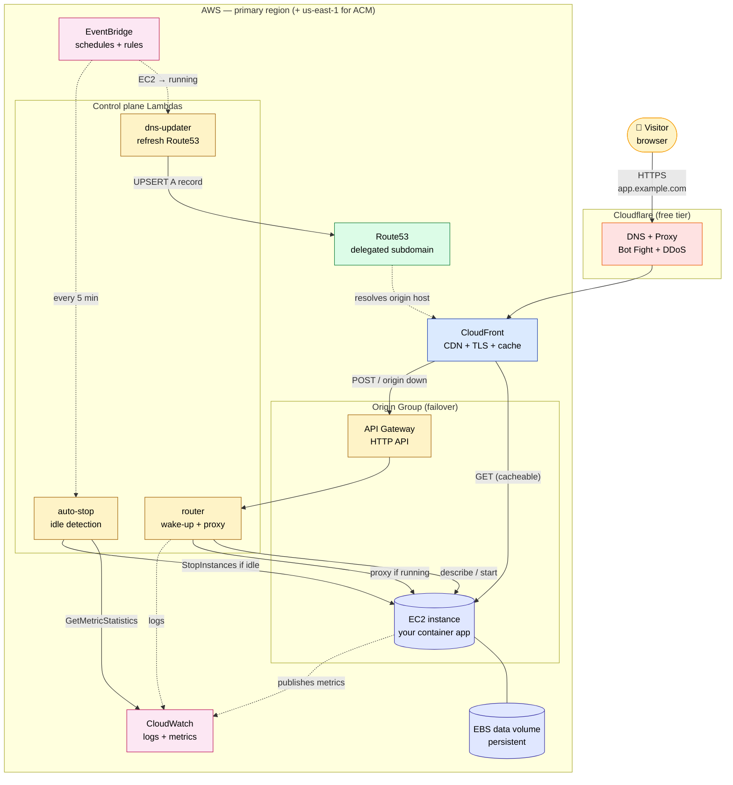
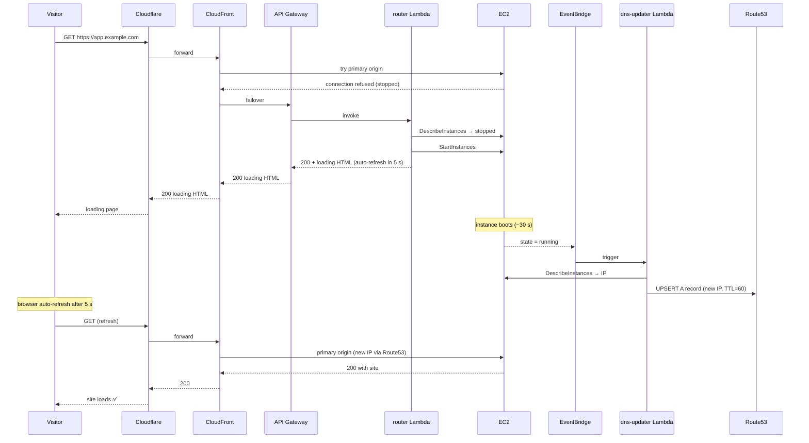
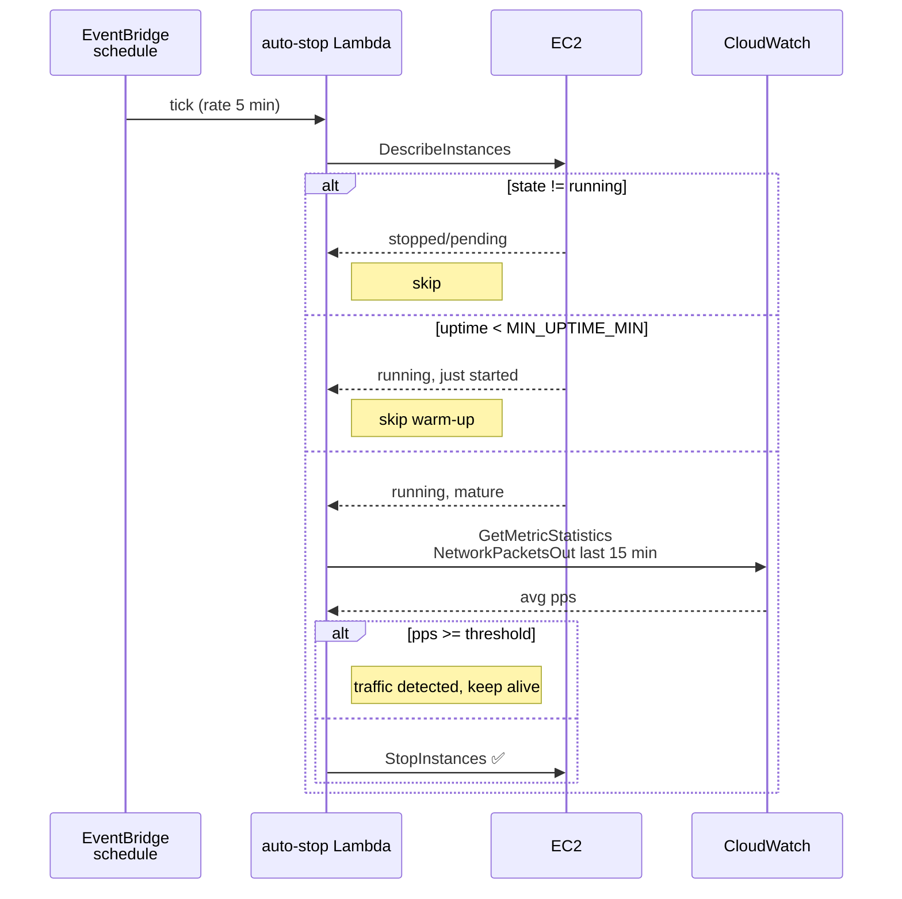

# Architecture

Three diagrams: the high-level component map, the cold-start sequence
(when a visitor arrives while the EC2 is stopped), and the periodic
auto-stop loop.

All three render natively on GitHub.

## High-level component map

### What each piece does

| Component | Responsibility |
| --- | --- |
| **Cloudflare** | Public DNS, free DDoS / bot mitigation, edge caching |
| **CloudFront** | TLS termination, regional caching, origin failover |
| **EC2** | Runs your actual application via Docker / systemd / whatever |
| **EBS data volume** | Persistent disk that survives stop/start cycles |
| **API Gateway + router Lambda** | Wake-up flow + proxy for POST when origin is down |
| **Route53 delegated zone** | Holds the dynamic A record CloudFront uses as origin |
| **dns-updater Lambda** | Updates the A record when EC2 gets a new public IP |
| **EventBridge rule** | Fires on `EC2 state-change → running` |
| **EventBridge schedule** | Fires every 5 minutes for the auto-stop check |
| **auto-stop Lambda** | Reads `NetworkPacketsOut` and stops idle instances |
| **CloudWatch** | Metrics for idle detection, logs for debugging |

## Cold-start sequence

What happens when a visitor arrives while the EC2 is stopped.

A few notes:

- The CloudFront connection-refused → failover path adds ≈3-5 s on the
  very first request after the EC2 has been stopped. Subsequent
  refreshes hit the loading page instantly because the failover route
  is now warm in CloudFront.
- The DNS update happens asynchronously. CloudFront re-resolves origin
  DNS on a 60 s timer (we set the A record TTL to 60), so by the time
  the user has refreshed twice, the new IP is in play.
- The total cold-start UX is therefore: one ≈3 s "loading screen" hit,
  then visible loading-page polling for 30-60 s, then the site appears.

## Auto-stop loop

What happens every 5 minutes.

We use **NetworkPacketsOut** as the activity signal because:

- A bored web server uses near-zero CPU even when serving health probes,
  so CPU alone gives lots of false negatives.
- Outbound packets correlate directly with serving real responses to
  visitors. If no one is asking, there's nothing to send back.
- Some background OS chatter always leaks ~1-2 packets/sec, so the
  threshold needs to sit a little above that (default `3.0 pps`).

CloudWatch publishes basic-monitoring metrics on **5-minute intervals**.
That's why the lookback window defaults to 15 min: it gives the metric
a chance to be published and averages out the noise without keeping the
EC2 alive forever after a single visit.
